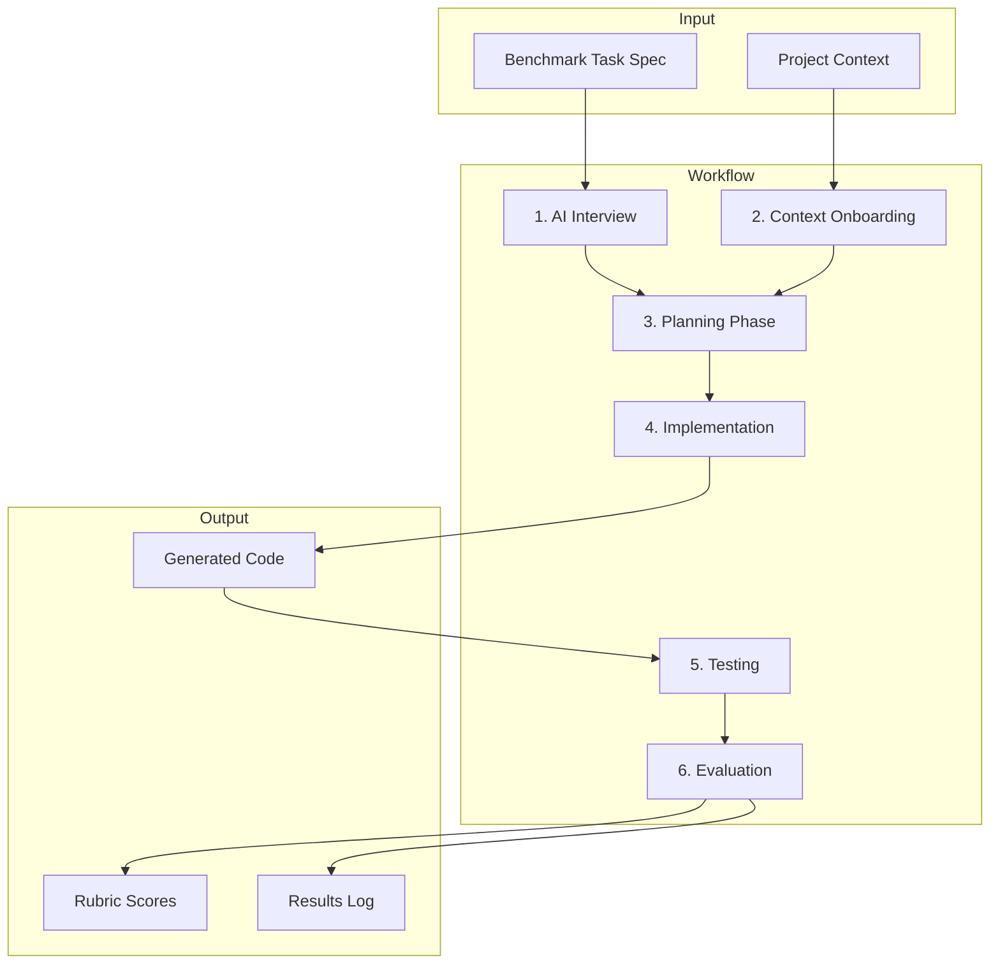

# Prototype Summary — Unity AI Evaluation Harness

**Capstone**: Agentic Coding Technique Evaluation  
**Student**: Austin Frock  
**Date**: February 2025

---

## What Was Built

The prototype is a **working Unity AI evaluation harness**—a mini benchmark lab for comparing how different AI tools (Cursor, GPT, Claude, Gemini, Codex) perform when generating Unity gameplay code.

### Deliverables

| Component | Location | Status |
|-----------|----------|--------|
| Unity benchmark testbed | `UnityBenchmarkTestbed/` | Complete |
| Baseline scene | `Assets/Scenes/BenchmarkScene.unity` | Complete |
| Flashlight benchmark task spec | `BENCHMARK_TASKS/FlashlightSystem.md` | Complete |
| Standardized workflow | `WORKFLOW.md` | Complete |
| Scoring rubric | `RUBRIC.md` | Complete |
| Results log | `RESULTS_LOG.md`, `results_log.csv` | Complete |
| Proof-of-concept run (Cursor) | `TEST_RUNS/FL-001_Cursor.md` | Complete |
| Second AI run | User to complete (see `TEST_RUNS/FL-002_INSTRUCTIONS.md`) | Pending |

---

## Framework Overview



---

## Benchmark Task: Flashlight System

The flashlight system requires:
- Toggle on/off (F key)
- Light component (Spot/Point)
- Battery (depletes when on, recharges when off)
- Audio (on/off, low battery)
- UI battery indicator

This task exercises Unity components, input, UI, audio, and configuration—revealing AI strengths and weaknesses without excessive scope.

---

## Proof-of-Concept: Cursor AI (FL-001)

### Implementation

**Files created**:
- `FlashlightBattery.cs` — Battery state, depletion, recharge, thresholds
- `FlashlightController.cs` — Input, light toggle, audio coordination
- `FlashlightUI.cs` — Battery bar/text display

**Design**:
- Component-based: Battery, Controller, UI separated
- No magic numbers: All tunables in serialized fields with `[Range]` and `[Tooltip]`
- Null-safe audio: Graceful behavior when clips are not assigned
- Inspector-friendly: Easy to tune in Unity Editor

### Code Example (FlashlightController — null-safe audio)

```csharp
private void PlaySound(AudioClip clip)
{
    if (_audioSource != null && clip != null)
        _audioSource.PlayOneShot(clip);
}
```

### Rubric Scores (FL-001)

| Category | Score |
|----------|-------|
| Code Quality | 18/20 |
| Unity Best Practices | 18/20 |
| Maintainability | 18/20 |
| Architectural Consistency | 14/15 |
| Error Accumulation Risk | 14/15 |
| Developer Intervention Required | 8/10 |
| **Total** | **90/100** |

---

## Screenshots

*(Add screenshots here after running in Unity:)*
- Screenshot 1: Unity project hierarchy with flashlight setup
- Screenshot 2: Game view with flashlight on and battery UI
- Screenshot 3: Inspector showing FlashlightController configuration

---

## How the Framework Scales

1. **Add benchmark tasks**: Create new specs (e.g., Player Controller, Enemy Patrol) in `BENCHMARK_TASKS/`
2. **Run more AI tools**: Follow `WORKFLOW.md` for each tool; log in `RESULTS_LOG.md`
3. **Expand rubric**: Add categories or sub-criteria in `RUBRIC.md` if needed
4. **Analyze results**: Export `results_log.csv` to spreadsheet; compare scores, iterations, time across tools

The prototype demonstrates that the system produces structured, comparable data—the foundation for the full capstone study.

---

## Next Steps for Full Study

1. Complete FL-002 with a second AI tool (GPT, Claude, Gemini, or Codex)
2. Add 1–2 more benchmark tasks
3. Run each task with all 5 AI tools (Cursor, GPT, Claude, Gemini, Codex)
4. Aggregate results; draw conclusions about agentic workflow effectiveness
5. Document findings for Sections 3 and 4 of the proposal
